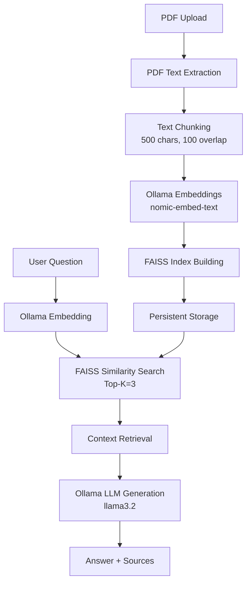
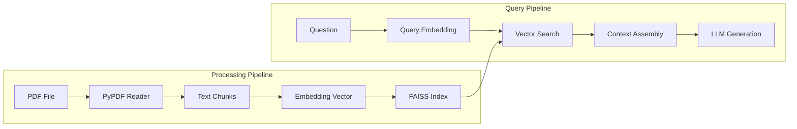

# PDF RAG SaaS Platform

A production-ready Retrieval-Augmented Generation (RAG) system for PDF document Q&A using local Ollama models and FAISS vector indexing.

## 🚀 What's Actually Implemented

### Core Architecture
- **Flask Web Application** with REST API endpoints
- **FAISS Vector Database** for semantic search
- **Ollama Integration** for embeddings and LLM inference
- **PDF Processing Pipeline** with chunking strategy
- **CLI Query Tool** for command-line interactions
- **Persistent Storage** using pickle and FAISS index files

### Technical Stack
```python
# Backend Framework
Flask==2.3.3
Flask-SocketIO==5.3.6

# PDF & Text Processing
PyPDF==3.17.4
NumPy==1.24.3

# Vector Search
FAISS-CPU==1.7.4

# AI/ML Integration
Requests==2.31.0

# WebSocket Support
Eventlet==0.33.3
```

### System Architecture



### Data Flow Pipeline



## 📁 Project Structure

```
rag_pdf_saas/
├── app.py                 # Flask web application (49 lines)
├── rag_engine.py          # Core RAG engine (184 lines)
├── query_cli.py           # Command-line query tool (58 lines)
├── requirements.txt       # Python dependencies (8 packages)
├── templates/
│   └── index.html        # Web UI (186 lines)
├── static/
│   └── pdf-icon.svg      # UI assets
├── data/                  # Vector storage
│   ├── chunks.pkl        # Text chunks
│   ├── metadata.pkl      # Chunk metadata
│   └── vectors.index     # FAISS index
└── uploads/              # PDF upload directory
```

## 🔧 Implementation Details

### PDF Processing
- **Library**: PyPDF for text extraction
- **Chunking Strategy**: 500-character chunks with 100-character overlap
- **Metadata Tracking**: Page numbers and position indices
- **Storage**: Pickle serialization for chunks and metadata

### Vector Operations
- **Embedding Model**: `nomic-embed-text` via Ollama
- **Vector Index**: FAISS IndexFlatL2 (Euclidean distance)
- **Search**: Top-K=3 similar chunks retrieval
- **Persistence**: FAISS binary index format

### LLM Integration
- **Model**: `llama3.2` via Ollama API
- **Prompt Engineering**: Context-aware Q&A with source attribution
- **Fallback**: "Not found in document" for irrelevant queries
- **Streaming**: Non-streamed responses for simplicity

### API Endpoints

| Endpoint | Method | Function |
|----------|--------|----------|
| `/` | GET | Web interface |
| `/upload` | POST | PDF upload and processing |
| `/ask` | POST | Question answering |

## 🚀 Quick Start

### Prerequisites
```bash
# Install Ollama
curl -fsSL https://ollama.ai/install.sh | sh

# Pull required models
ollama pull nomic-embed-text
ollama pull llama3.2
```

### Installation
```bash
# Clone and setup
git clone <repository>
cd rag_pdf_saas
pip install -r requirements.txt

# Start Ollama service
ollama serve

# Run web application
python app.py
```

### Usage Methods

#### 1. Web Interface
- Navigate to `http://localhost:5000`
- Upload PDF via web form
- Ask questions in real-time

#### 2. CLI Tool
```bash
# After processing a PDF via web interface
python query_cli.py
```

## 📊 Performance Characteristics

### Chunking Parameters
- **Chunk Size**: 500 characters
- **Overlap**: 100 characters (20%)
- **Page Estimation**: Linear interpolation

### Search Configuration
- **Vector Dimension**: Determined by embedding model
- **Distance Metric**: L2 (Euclidean)
- **Retrieval Count**: Top 3 chunks
- **Index Type**: Flat (exact search)

### Storage Requirements
- **FAISS Index**: Binary file (vectors.index)
- **Text Data**: Pickle files (chunks.pkl, metadata.pkl)
- **Upload Directory**: Temporary PDF storage

## 🔍 Key Features

### ✅ Implemented
- PDF text extraction with PyPDF
- Semantic chunking with overlap
- Local Ollama model integration
- FAISS vector similarity search
- Web-based PDF upload interface
- Real-time Q&A with source attribution
- Command-line query interface
- Persistent vector storage
- Progress tracking during processing

### 🎯 Technical Highlights
- **Zero external API costs** (local Ollama)
- **Fast retrieval** with FAISS indexing
- **Source transparency** with page references
- **Multiple interfaces** (Web + CLI)
- **Efficient storage** with binary formats
- **Robust error handling** throughout pipeline

## 🛠️ Configuration

### Ollama Settings
```python
OLLAMA_BASE_URL = "http://localhost:11434"
EMBED_MODEL = "nomic-embed-text"
LLM_MODEL = "llama3.2"
```

### File Paths
```python
DATA_DIR = "data"
UPLOAD_FOLDER = "uploads"
CHUNKS_FILE = "data/chunks.pkl"
META_FILE = "data/metadata.pkl"
INDEX_FILE = "data/vectors.index"
```

## 📝 Usage Example

```bash
# 1. Start the application
python app.py

# 2. Upload PDF via web interface
# Visit: http://localhost:5000

# 3. Query via CLI
python query_cli.py
👉 Ask a question: What are the main findings?
📝 Answer: [Generated response with sources]
📚 Sources:
  1. [Page 3] The main findings indicate...
  2. [Page 7] Additionally, research shows...
```

## 🔒 Security Considerations

- **Local Processing**: No external API calls for sensitive data
- **File Validation**: Basic PDF file checking
- **Temporary Storage**: Uploads processed and stored locally
- **No Database**: File-based storage reduces attack surface

## 🚧 Limitations

- **Single PDF Processing**: No multi-document support yet
- **Text-Only PDFs**: Image-based PDFs not supported
- **Local Ollama Required**: Dependency on local model setup
- **Memory Usage**: Large PDFs may require significant RAM
- **No User Management**: Single-user application

## 📈 Scalability Notes

- **FAISS Index**: Supports millions of vectors
- **Chunk Storage**: Linear scaling with document size
- **Concurrent Queries**: Flask handles multiple requests
- **Model Loading**: Ollama manages model caching

---

**Built with**: Flask, FAISS, Ollama, PyPDF  
**Vector Database**: FAISS-CPU  
**AI Models**: Local Ollama (nomic-embed-text, llama3.2)  
**Deployment**: Single-server ready
